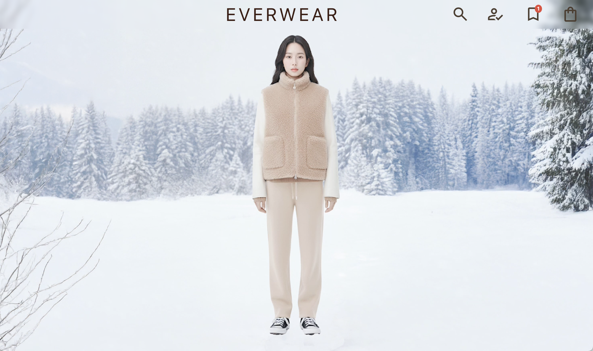

# EverWear 官方線上商店｜Official Online Store

## 👥 共同協作者｜Contributors

 XiatinTW  
 eriweng  
 Leigh0315  
 Ginnie1114  

---

## 💻 技術｜Tech Stack

- 🎨 前端技術｜Frontend：TailwindCSS、GSAP、React.js、CSS、JavaScript
- 🛠️ 後端技術｜Backend：Node.js、MySQL
- 📝 草稿繪製｜Prototyping：Figma
- 🔄 版本管理｜Version Control：Git、GitHub
- 🤖 自動化工具＆影像處理｜Automation & Image Processing：N8N、ComfyUI

---

## 🌏 專案簡介｜Project Introduction

台灣製造機能美學的全球發聲平台  
*A global platform for Taiwan-made functional aesthetics.*

---

## 🎯 專案動機｜Motivation

隨著戶外活動在台灣持續升溫，消費者對兼具「專業機能」與「日常穿搭」的高端服飾需求日益增加。

市場現有品牌（如 Arc’teryx、Aigle）雖擁有穩固客群，但仍有空間容納具備差異化設計與在地故事的新品牌。

*As outdoor activities gain popularity in Taiwan, the demand for high-end apparel that combines professional functionality and everyday style is rising. While established brands (e.g., Arc’teryx, Aigle) have loyal customers, there remains space for new brands featuring differentiated design and local storytelling.*

---

## 💡 專案目標｜Project Goal

本專案旨在打造一個專屬於台灣科技紡織與耐用工藝的線上品牌，服務於追求高性能裝備與生活美學的特定族群。

*The project aims to build an online brand dedicated to Taiwanese textile technology and durable craftsmanship, serving communities that pursue high-performance gear and lifestyle aesthetics.*

---

## 🚩 特色亮點｜Key Features

- **台灣製造｜Made in Taiwan**：結合在地技術與創新設計  
  *Combining local technology and innovative design*
- **機能美學｜Functional Aesthetics**：強調專業功能與時尚外觀兼備  
  *Professional functionality and stylish appearance*
- **全球平台｜Global Platform**：讓台灣品牌走向世界  
  *Showcasing Taiwanese brands to the world*

---

## 📊 目標族群分析｜Target Audience

| 區域 Area        | 年齡層 Age       | 收入/資產 Income/Assets        | 生活型態與價值觀 Lifestyle & Values                                  |
| ---------------- | --------------- | ------------------------------ | -------------------------------------------------------------- |
| 台灣 Taiwan      | 25-45歲         | 年收入 100 萬 TWD 以上 / 穩定中高收入 | 熱衷登山、健行、露營、戶外探險；注重機能與舒適度；關注品牌研發背景與產品耐用性​ Enthusiastic about outdoor activities; values function, comfort, and durability. |
| 北美/歐洲 NA/EU  | 25–50歲         | 年收入 USD 60,000+；戶外活動愛好者 | 積極參與登山、滑雪、攀岩、健行等戶外活動，追求高性能裝備與長使用壽命​ Active in hiking, skiing, climbing; seeking high-performance, durable gear. |
| 亞洲其他地區 Asia Others | 25–40歲     | 中高收入；熱衷戶外與都會混搭        | 將機能性服飾視為日常穿搭的一部分，注重時尚感與實用性兼具​​ Integrates functional apparel into everyday style; values both fashion and practicality. |

---